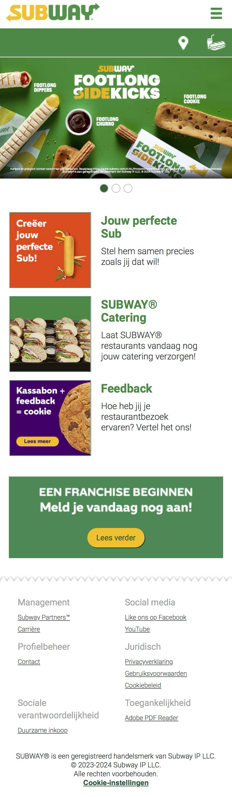
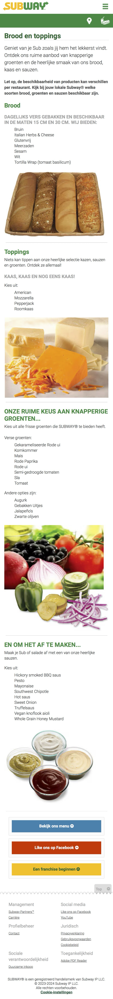
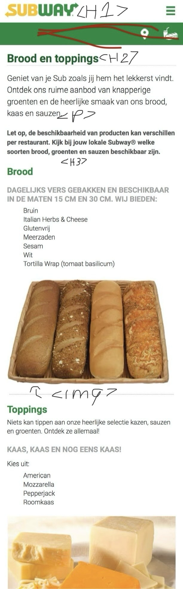
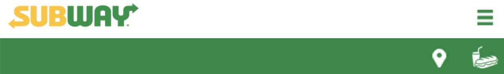
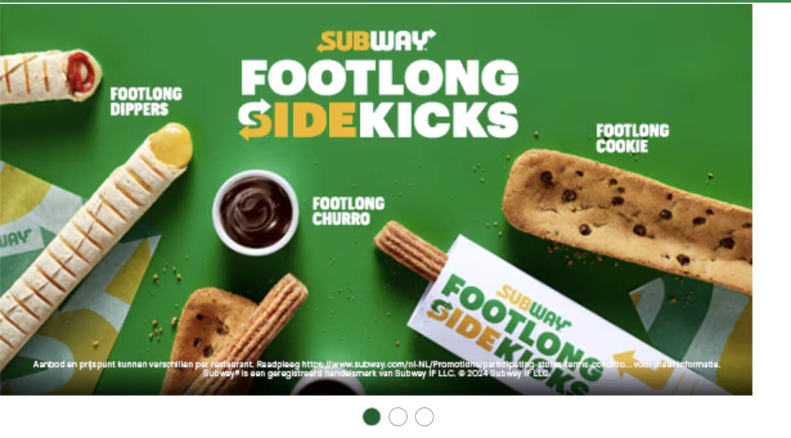
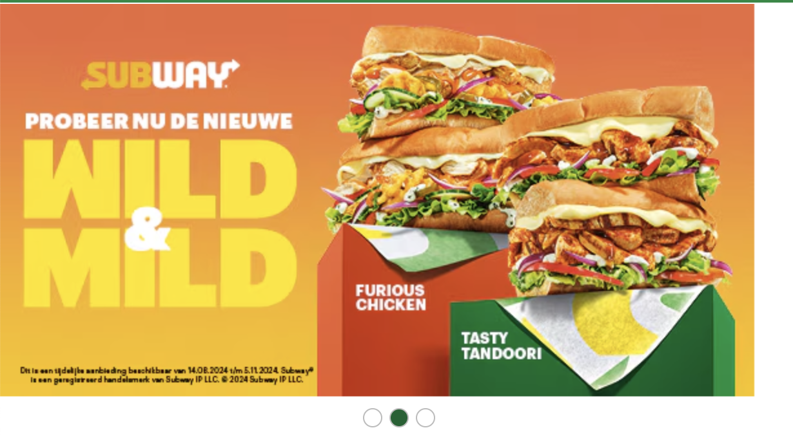
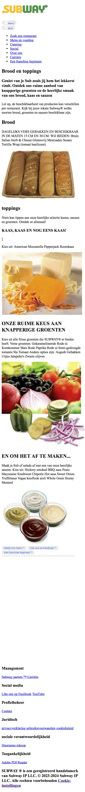
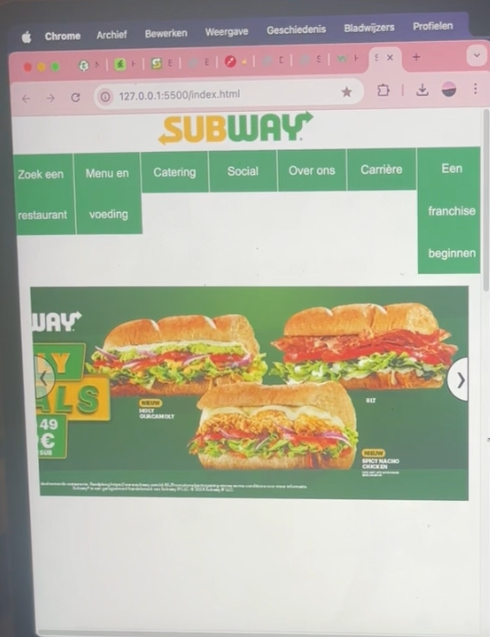
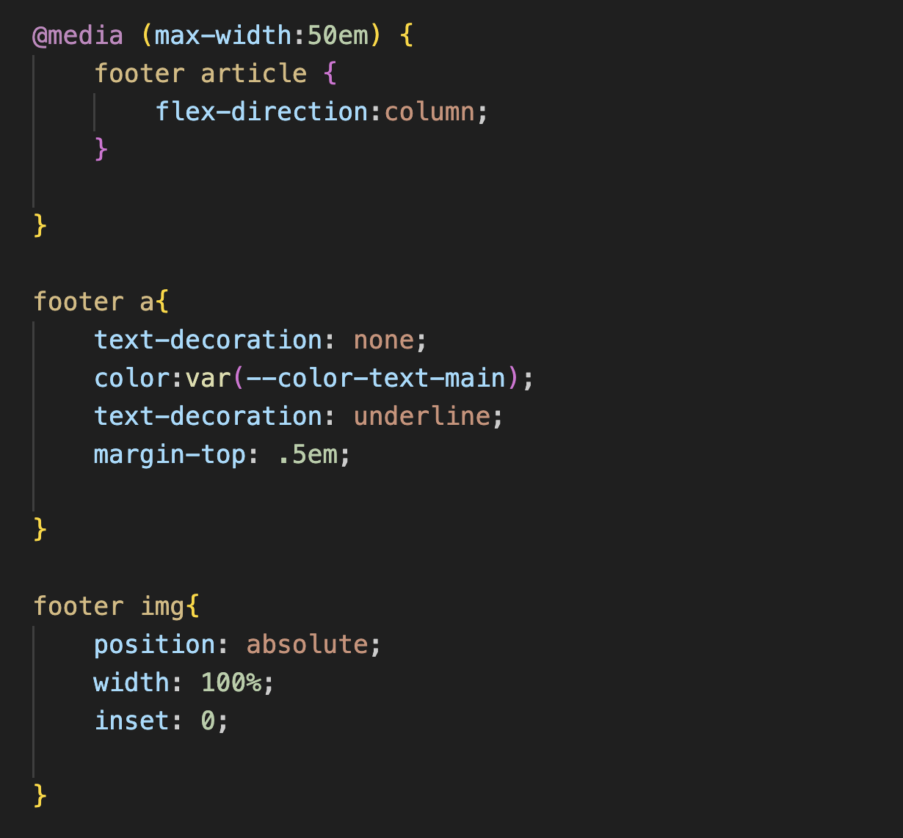

# Procesverslag
Markdown is een simpele manier om HTML te schrijven.  
Markdown cheat cheet: [Hulp bij het schrijven van Markdown](https://github.com/adam-p/markdown-here/wiki/Markdown-Cheatsheet).

Nb. De standaardstructuur en de spartaanse opmaak van de README.md zijn helemaal prima. Het gaat om de inhoud van je procesverslag. Besteedt de tijd voor pracht en praal aan je website.

Nb. Door *open* toe te voegen aan een *details* element kun je deze standaard open zetten. Fijn om dat steeds voor de relevante stuk(ken) te doen.

<!-- in read me toevoegen wat je wou toevoegen maar geen tijd voor had -->

## Jij

  
uitwerken voor kick-off werkgroep

  ### Auteur:
  Lola Broos

  #### Je startniveau:
  Blauw

  #### Je focus:
  Ik heb gekozen om de pagina's responsive te maken.
 

## Je website

  

  Voor deze school opdracht voor het vak Frontend Development moet ik een website gaan na maken. Hiervan moet ik de home-pagina en een detail pagina maken. Het basis voormaat voor de site is een telefoon formaat. voor deze opdracht heb ik keuze uit 2 uitgang punten. Ik kan kiezen om de site responsive te maken of survace plane te maken (dit houd in dat de focus op animatie ligt). 
  

  ### Je opdracht:
  link naar de website die je gaat namaken óf de naam/omschrijving van je eigen ontwerp
  Ik ga de website subway namaken, voor de detail pagina heb ik gekozen voor "jouw perfecte sub pagina". 
  https://www.subway.com/nl-NL/
  https://www.subway.com/nl-NL/MenuNutrition/Menu/BreadsAndToppings

  

  #### Screenshot(s) van de eerste pagina (small screen): 
  hier de naam van de pagina  
  

  #### Screenshot(s) van de tweede pagina (small screen):
  hier de naam van de pagina  
  
 

## Toegankelijkheidstest 1/2 (week 1)

  
uitwerken na test in 2e werkgroep

  ### Bevindingen
  Lijst met je bevindingen die in de test naar voren kwamen:
  - sommige delen tekst hebben geen focus
  - foto's met tekst inhoud hebben en lege alt en worden dus genegeerd
  - text wordt overgeslagen

## Breakdownschets (week 1)

  
uitwerken na afloop 3e werkgroep

  ### de hele pagina: 
  
  

  ### dynamisch deel (bijv menu): 
  
   

  ### wellicht nog een dynamisch deel (bijv filter): 
  
  

## Voortgang 1 (week 2)

  
uitwerken voor 1e voortgang
 

  ### Stand van zaken
 ik heb mijn html voor mijn twee pagina's gemaatk
    
    

  ### Agenda voor meeting
  ik heb nog geen specefieke vragen omdat ik alleen nog maar de html heb

  ### Verslag van meeting
 Ik had alleen nog de html code, maar ik werd geholpen om mijn html correct te maken met articles en divs

## Voortgang 2 (week 3)

  
uitwerken voor 2e voortgang

  ### Stand van zaken
 Ik ben begonnen met mijn css ik had wel last met de navigatie balk en hoe ik doe beter responsive kon maken. 
  

  ### Agenda voor meeting
  vragen over mijn navigatie bar en hoe ik de beter responive kan maken 

  ### Verslag van meeting
 - nog een keer de oefening maken en daar de oplossing vinden

## Toegankelijkheidstest 2/2 (week 4)

  
uitwerken na test in 9e werkgroep

  ### Bevindingen
  - list toevoegen
  - bij de footer staat de tekst erg dichtbij elkaar

## Voortgang 3 (week 4)

  
uitwerken voor 3e voortgang

  ### Stand van zaken
mijn nav bar werkt nog steeds niet en het lukt niet om mijn footer goed responsive te maken

  ### Agenda voor meeting
  vragen om hoe ik mijn nav bar en footer kan verbeteren

  ### Verslag van meeting
 @media gebruiken voor de footer
 javascript voor de navigatie gebruiken zodat het een hamburger menu wordt
  

## Eindgesprek (week 5)

  
uitwerken voor eindgesprek

  ### Je uitkomst - karakteristiek screenshots:
  

  ### Dit ging goed/Heb ik geleerd: 
  Korte omschrijving met plaatjes

  

  ### Dit was lastig/Is niet gelukt:
  Korte omschrijving met plaatjes

  

## Bronnenlijst

  
continu bijhouden terwijl je werkt

  Nb. Wees specifiek ('css-tricks' als bron is bijv. niet specifiek genoeg). 
  Nb. ChatGpT en andere AI horen er ook bij.
  Nb. Vermeld de bronnen ook in je code.

  1. bron 1
  2. bron 2
  3. ...

