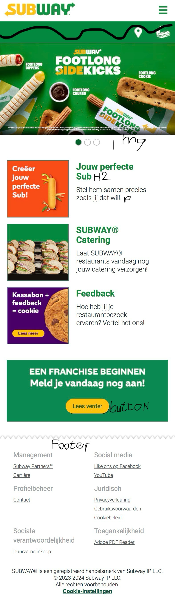
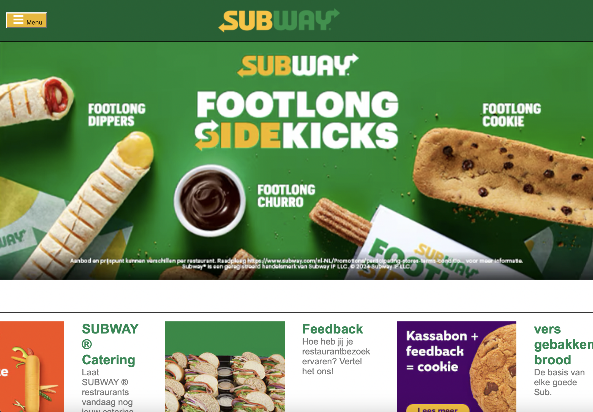
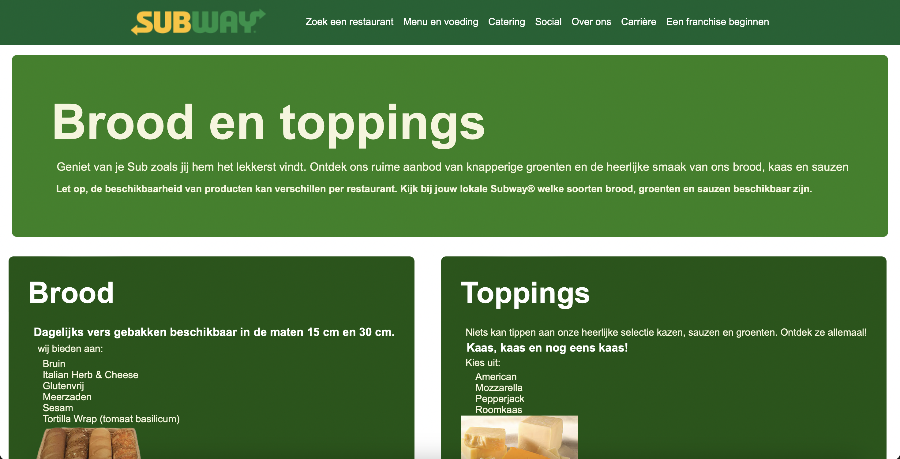

# Procesverslag
Markdown is een simpele manier om HTML te schrijven.  
Markdown cheat cheet: [Hulp bij het schrijven van Markdown](https://github.com/adam-p/markdown-here/wiki/Markdown-Cheatsheet).

Nb. De standaardstructuur en de spartaanse opmaak van de README.md zijn helemaal prima. Het gaat om de inhoud van je procesverslag. Besteedt de tijd voor pracht en praal aan je website.

Nb. Door *open* toe te voegen aan een *details* element kun je deze standaard open zetten. Fijn om dat steeds voor de relevante stuk(ken) te doen.

<!-- in read me toevoegen wat je wou toevoegen maar geen tijd voor had -->

## Jij

  
uitwerken voor kick-off werkgroep

  ### Auteur:
  Lola Broos

  #### Je startniveau:
  Blauw

  #### Je focus:
  Ik heb gekozen om de pagina's responsive te maken.
 

## Je website

  

  Voor deze school opdracht voor het vak Frontend Development moet ik een website gaan na maken. Hiervan moet ik de home-pagina en een detail pagina maken. Het basis voormaat voor de site is een telefoon formaat. voor deze opdracht heb ik keuze uit 2 uitgang punten. Ik kan kiezen om de site responsive te maken of survace plane te maken (dit houd in dat de focus op animatie ligt). 
  

  ### Je opdracht:
  link naar de website die je gaat namaken óf de naam/omschrijving van je eigen ontwerp
  Ik ga de website subway namaken, voor de detail pagina heb ik gekozen voor "jouw perfecte sub pagina". 
  https://www.subway.com/nl-NL/
  https://www.subway.com/nl-NL/MenuNutrition/Menu/BreadsAndToppings

  

  #### Screenshot(s) van de eerste pagina (small screen): 
  hier de naam van de pagina  
  

  #### Screenshot(s) van de tweede pagina (small screen):
  hier de naam van de pagina  
  
 

## Toegankelijkheidstest 1/2 (week 1)

  
uitwerken na test in 2e werkgroep

  ### Bevindingen
  Lijst met je bevindingen die in de test naar voren kwamen:
  - sommige delen tekst hebben geen focus
  - foto's met tekst inhoud hebben en lege alt en worden dus genegeerd
  - text wordt overgeslagen

## Breakdownschets (week 1)

  
uitwerken na afloop 3e werkgroep

  ### de hele pagina: 
  
  

  ### dynamisch deel (bijv menu): 
  
   

  ### wellicht nog een dynamisch deel (bijv filter): 
  
  

## Voortgang 1 (week 2)

  
uitwerken voor 1e voortgang
 

  ### Stand van zaken
 ik heb mijn html voor mijn twee pagina's gemaatk
    
    

  ### Agenda voor meeting
  ik heb nog geen specefieke vragen omdat ik alleen nog maar de html heb

  ### Verslag van meeting
 Ik had alleen nog de html code, maar ik werd geholpen om mijn html correct te maken met articles en divs

## Voortgang 2 (week 3)

  
uitwerken voor 2e voortgang

  ### Stand van zaken
 Ik ben begonnen met mijn css ik had wel last met de navigatie balk en hoe ik doe beter responsive kon maken. 
  

  ### Agenda voor meeting
  vragen over mijn navigatie bar en hoe ik de beter responive kan maken 

  ### Verslag van meeting
 - nog een keer de oefening maken en daar de oplossing vinden

## Toegankelijkheidstest 2/2 (week 4)

  
uitwerken na test in 9e werkgroep

  ### Bevindingen
  - list toevoegen
  - bij de footer staat de tekst erg dichtbij elkaar

## Voortgang 3 (week 4)

  
uitwerken voor 3e voortgang

  ### Stand van zaken
mijn nav bar werkt nog steeds niet en het lukt niet om mijn footer goed responsive te maken

  ### Agenda voor meeting
  vragen om hoe ik mijn nav bar en footer kan verbeteren

  ### Verslag van meeting
 @media gebruiken voor de footer
 javascript voor de navigatie gebruiken zodat het een hamburger menu wordt
  

## Eindgesprek (week 5)

  
uitwerken voor eindgesprek

  ### Je uitkomst - karakteristiek screenshots:
  
  

  ### Dit ging goed/Heb ik geleerd: 
  Korte omschrijving met plaatjes
  het ging uiteindelijk goed op flexbox te gebruiken en nu weet ik ook veel meer over flexbox en hoe ik dat beter kan gebruiken

  
  

  ### Dit was lastig/Is niet gelukt:
  Korte omschrijving met plaatjes
  wat mij niet is gelukt maar wel had willen toevoegen als ik meer tijd had was dat op de home pagina dat het franschishe hetzelfde was zoals bij de echte subway site, ik denk zelf dat ik de afbeelding had kunnen tonen door @media en dan min/max width te kunnen gebruiken. 

  wat ik erg lastig vond was de carousel, ik had veel tutorials gevolgd en er kwam maar geen goede carousel uit die goed werkte en responsive was. uiteindelijk zag ik op teams een codepen van een carousel en heb ik die overgenomen, ik vind het nog steeds lastig maar ik snap de code wel. 

  
  
  

## Bronnenlijst

  
continu bijhouden terwijl je werkt

  Nb. Wees specifiek ('css-tricks' als bron is bijv. niet specifiek genoeg). 
  Nb. ChatGpT en andere AI horen er ook bij.
  Nb. Vermeld de bronnen ook in je code.

  1. carousel codepen:https://codepen.io/shooft/pen/mdBOZLz?editors=0010
  2. @media bron: https://developer.mozilla.org/en-US/docs/Web/CSS/CSS_media_queries/Using_media_queries
  3. registered symbols bron; https://www.wikihow.com/Add-a-Registered-Symbol-in-HTML#:~:text=In%20PHP%2C%20Perl%2C%20or%20Ruby,Docs%3A%20Type%20(r)%20

## Herkansing

  
Feedback 

  - navigatie beter responsive maken
  - tweede pagina visiueel verbeteren
  - read me beter uitwerken voor de herkansing

  
 Plan van aanpak 

  - Ik wil voor de navigatie de media min-width groter maken zodat het hamburger menu eerder komt. Ook wil ik de button in het hamburger menu doormidel van flexbox naar links zetten.
  - op de homepagina wil ik de franschise button weer goed zetten.
  - voor de detail pagina wil ik het mooier maken door alles vooral in hetmidden te zetten. ook wil ik de buttons minder groot maken.  

  
 Navigatie en franschise button

  -  ik heb bij de navigaite de min-width veranderd zodat er eerder naar het hamburger menu wordt gesprongen. Ik heb ook de sluit button op dezelfde plek gezet zodat het sluiten van het menu makkelijk ging.

  

  

  
  

De detailpagina

- voor de detail pagina wil ik de articles een achtergrond kleur geven en in vlakken zetten zodat het duidelijker is wat bij elkaar hoort. Ook wordt het hierdoor een mooiere pagina. 

  
  
  
  
  Bij mijn eerste poging had ik padding gebruikt om de achtergrond kleur groter te maken en het een vlak te maken. Bij de eerste 2 articles ziet het er goed uit, alleen bij de laatste 2 is er meer padding nodig om de ruimte gelijk te maken. Doordat er meer padding bij de laatste 2 articles is stond de tekst hier niet mooi meer. ik had eerst veel gepuzzeld om alle tekst met margin naar links te brengen maar na veel code zag het er nog steeds niet goed uit en wou ik het op een andere manier proberen. 

  
  
  

  Voor de nieuwe poging had ik het idee om de widht om 50% te zetten. op het laptop groote werkte dit heel goed alleen werkte het niet met de responsiveness.

  ik had toen aan chatgpt gevraagd hoe ik het responsive kon houden hier gaf hij meerdere dingen. ik heb toen 2 regels gepakt. 
  "flex: 1 1 calc(33.333% - 20px); /* Past zich aan om drie artikelen per rij te hebben */
    box-sizing: border-box;"
  ik heb de flex calc aangepast van 33.333% naar 50% zodat het 2 artikelen zijn in plaats van 3. Ook heb ik voor de eerste article de calc 100% gemaakt zodat die in zijn eentje boven aan blijft. 
  
  
  
  
  ik vond dat het te lang duurde voordat het scherm van 2 naar 1 article ging dus heb ik ook een @media toegevoegd

  

  chatgpt link: https://chatgpt.com/share/672a2cbe-69bc-800c-8a92-7636fbe61e16

  
 buttons op de 2de pagina 

  om de buttons dezelfde lengte te maken heb ik flex:1; toegevoegd. Om het meer gesponsive te maken heb ik @media toegevoegd zodat het op een mooie groote de eerst volgende button naar beneden springt.

  
  
  

voor de @media had ik nog een twijfel of ik de max-width op 60em of 75em moest zetten. als ik het op 60 em zet zijn de buttons langer naast elkaar. alleen gaat de tekst in button dan op een bepaald moment onder elkaar staan. 

als ik de max width op 75em zet gebeurt dat niet alleen zijn de buttons dan erg lang

ik vond het beter om verder te gaan met 75em max-width. 

om de buttons minder lang te maken had ik margin left en right toegevoegd, alleen kon ik dat maar tot en met 9em doen want bij 10em ging de tekst weer onder elkaar staan. 
ik heb gebropeerd om om width en max-width toe te voegen maar toen kwam de tekst weer onder elkaar

ik heb daarom gekozen om margin te gebruiken omdat ik niet weet hoe ik het anders moet oplossen.

